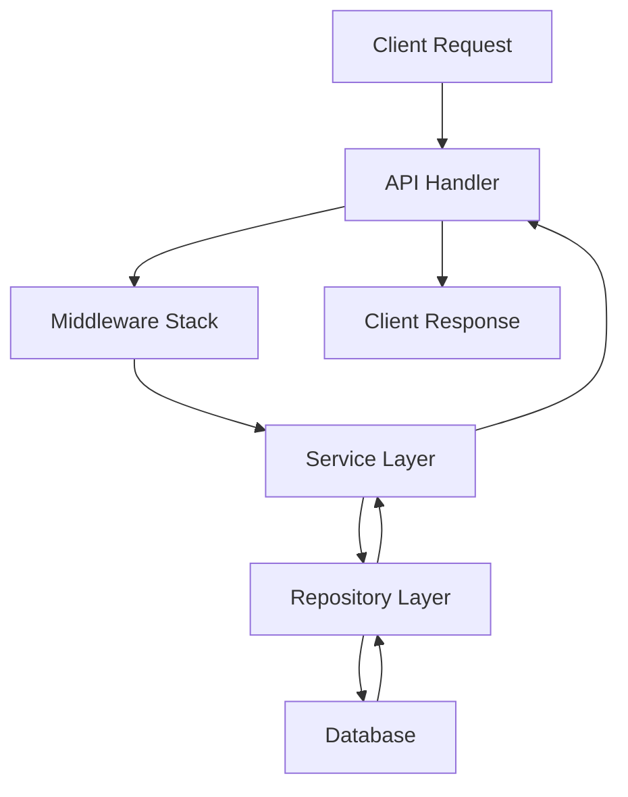

# Backend Architecture Overview

The SkyGuard backend is built with Node.js, TypeScript, and SQL Server, following a layered architecture pattern that prioritizes security, maintainability, and scalability. This documentation provides comprehensive guidelines for developing and maintaining the backend system.

## Architecture Principles

Our backend follows these core principles:

- **Security First**: All components implement security best practices from the ground up
- **Layer Separation**: Clear boundaries between API, Service, Repository, and Database layers
- **Type Safety**: Comprehensive TypeScript typing throughout the codebase
- **Consistency**: Standardized patterns and conventions across all modules
- **Testability**: Architecture designed to support comprehensive testing strategies

## High-Level Structure

```
src/
├── api/                   # API layer - HTTP request handling
│   └── v1/               # Versioned API endpoints
├── core/                 # Core application logic
│   ├── database/        # Database layer & repositories
│   ├── services/        # Business logic layer
│   ├── models/          # Data models and DTOs
│   ├── middleware/      # Express middleware
│   └── config/          # Application configuration
└── utils/               # Shared utilities
```

## 🔄 Layer Architecture

### 1. API Layer
- **Purpose**: Handle HTTP requests and responses
- **Location**: `src/api/v1/`
- **Responsibilities**:
  - Request validation and sanitization
  - Response formatting
  - Authentication middleware integration
  - OpenAPI documentation

### 2. Service Layer
- **Purpose**: Implement business logic
- **Location**: `src/core/services/`
- **Responsibilities**:
  - Business rule enforcement
  - Transaction management
  - Permission checking
  - Service-to-service communication

### 3. Repository Layer
- **Purpose**: Data access abstraction
- **Location**: `src/core/database/repositories/`
- **Responsibilities**:
  - Database query execution
  - Data mapping
  - SQL security (parameterized queries)
  - Connection management

### 4. Database Layer
- **Purpose**: Data persistence
- **Technology**: SQL Server with migrations
- **Responsibilities**:
  - Schema management
  - Data integrity
  - Performance optimization
  - Audit logging

## 🔒 Security Architecture

Security is implemented at every layer:

### Authentication & Authorization
- **JWT-based authentication** with refresh token rotation
- **Role-based access control** (RBAC) with organization scoping
- **Permission checking** at the service layer
- **Secure session management**

### Data Protection
- **Parameterized SQL queries** prevent injection attacks
- **Input validation and sanitization** at API boundaries
- **Sensitive data encryption** at rest and in transit
- **Audit logging** for security events

### API Security
- **Rate limiting** to prevent abuse
- **CORS configuration** for cross-origin requests
- **Security headers** (HSTS, CSP, etc.)
- **Request/response sanitization**

## 📊 Data Flow



1. **Client sends request** to API endpoint
2. **API handler** validates and routes request
3. **Middleware** handles authentication, logging, etc.
4. **Service layer** processes business logic
5. **Repository layer** executes database operations
6. **Response** flows back through the layers

## Testing Strategy

Our testing approach covers all layers:

- **Unit Tests**: Service and utility functions
- **Integration Tests**: API endpoints with database
- **Repository Tests**: Database operations
- **Security Tests**: Authentication and authorization
- **Performance Tests**: Load and stress testing

## 📋 Development Guidelines

### New Feature Development
1. **Design API endpoints** following RESTful conventions
2. **Implement service layer** with proper business logic
3. **Create repository methods** with parameterized queries
4. **Add comprehensive tests** at all layers
5. **Document API endpoints** with OpenAPI specs

### Code Quality Standards
- **TypeScript**: Explicit typing, no `any` types
- **Error Handling**: Standardized error responses
- **Security**: Input validation, SQL parameterization
- **Performance**: Efficient queries, caching strategies
- **Documentation**: Inline comments and API docs

## 🚀 Getting Started

For new developers:

1. **Read the [Project Structure](./project-structure)** guide
2. **Review [Coding Standards](./coding-standards)** for conventions
3. **Study [Database Architecture](./database-architecture)** for data patterns
4. **Understand [Security Guidelines](./security-guidelines)** - critical for all development
5. **Follow [Testing Strategy](./testing-strategy)** for quality assurance

## 📚 Quick Reference

### Security Checklist
- [ ] Use parameterized queries exclusively
- [ ] Implement proper JWT validation
- [ ] Check permissions at service layer
- [ ] Validate and sanitize all inputs
- [ ] Log security-relevant events

### Development Checklist
- [ ] Follow naming conventions
- [ ] Use repository pattern for data access
- [ ] Add OpenAPI documentation
- [ ] Write comprehensive tests
- [ ] Implement proper error handling

---

This architecture ensures a scalable, secure, and maintainable backend system. For detailed implementation guidance, refer to the specific architecture documents linked throughout this overview.